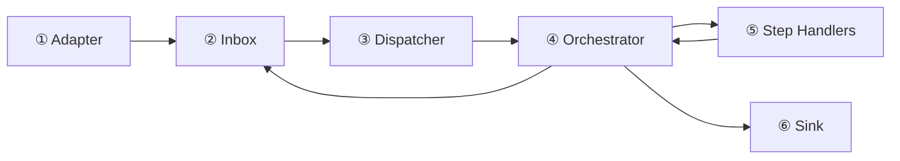
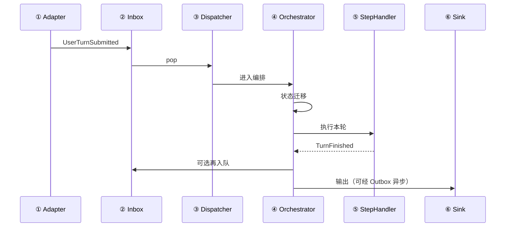

# 事件驱动与会话编排（设计备忘）

本文描述「可扩展运行时」的**目标分层**：从大到小依次为 **Producer / Adapter → Inbox 队列 → Dispatcher → Orchestrator → Step Handlers → Sink**。与当前 `apps/llm-cli` 实现不必一一对应，落地时可按层迁移。

---

## 从大到小：六层一览

| 顺序 | 层次 | 一句话 |
|:----:|------|--------|
| ① | **Producer / Adapter** | 把**原始世界**变成**语义事件** |
| ② | **Inbox 队列** | 事件排队、解耦、背压（多源合并入口） |
| ③ | **Dispatcher** | 事件类型 → 交给谁处理（路由 / 订阅表） |
| ④ | **Orchestrator** | **流程状态**与**允许走哪步**；发下一步意图 |
| ⑤ | **Step Handlers** | **真正干活**（模型、工具、IO）；可内含多圈 O-R-A |
| ⑥ | **Sink** | 把结果写回**用户可见**或**外部系统** |

**数据走向（大 → 小）**：① → ② → ③ → ④ → ⑤ → ⑥；⑤ 执行完后，**事实**回到 ④，由 ④ 决定再入队 ② 或直达 ⑥。

---

## ① Producer / Adapter

### 在整体中的位置

- **从大到小**：最靠**外**、最贴近 OS / 网络 / 终端的一层；**下游唯一依赖**是：向 **② Inbox** 投递事件。
- **上游**：用户、管道、将来可能的 socket、IDE 插件等。

### 职责

- 把**非结构化输入**（字节、按键、帧）整理成**结构化语义事件**（例如「用户提交一轮对话」「EOF」「连接断开」）。
- 可做**行缓冲**、**元命令**（如 `/exit`）在进业务前的拦截与翻译。
- **不做**：不维护会话流程图、不决定「这一步能不能调模型」（那是 ④）。

### 输入 / 输出

| | 内容 |
|--|------|
| 输入 | 原始 I/O、定时器、外部回调 |
| 输出 | **Event**（入 ②） |

### 可扩展点

- 新输入源 = 新 Adapter，**同一套 Event 协议**入队即可。

---

## ② Inbox 队列

### 在整体中的位置

- **从大到小**：在 ① 之后、**③④⑤⑥ 之前**；是「多源进、单（或多）消费端出」的**枢纽**。
- **最外层循环**通常写在这里的**消费端**：`recv` / `pop` 的循环，而不是写在 Step 里。

### 职责

- **传递**事件；在单消费者模型下提供**全序处理**（仅指「出队顺序」，不等于业务因果）。
- **背压**：建议**有界**队列，满时策略（阻塞、丢、合并）要明确。
- **生命周期**：启动、关闭（drain、残留事件是否丢弃）要有约定。

### 输入 / 输出

| | 内容 |
|--|------|
| 输入 | ① 投递的 Event |
| 输出 | 交给 **③ Dispatcher** 的 Event（同一条或经包装） |

### 注意

- 队列**不表达**「事件 B 必须等事件 A 的业务语义」；因果放在 **④**。

---

## ③ Dispatcher

### 在整体中的位置

- **从大到小**：在 **②** 之后、**④** 之前；薄薄一层，**不做**长流程状态机（避免与 ④ 抢活）。

### 职责

- **按事件类型**（或 topic）选择入口：直接进 **④**、或进某个中间 Handler、或先过全局**策略**（日志、鉴权）。
- 等价于「**订阅表** / 路由表」：类型 → 处理函数或子 channel。

### 输入 / 输出

| | 内容 |
|--|------|
| 输入 | ② 出队的一条 Event |
| 输出 | 调用 **④** 或预处理后的事件流 |

### 可扩展点

- 新事件类型 = 注册新路由；**不必**改中央 `while` 体，只改表。

---

## ④ Orchestrator（工作流 / Saga / 流程管理器）

### 在整体中的位置

- **从大到小**：在 **③** 之后、**⑤** 之前；是「**剧本与门禁**」，不是「干体力活」。
- 接收来自 ③ 的**事实事件**，更新**流程 cursor**，再决定是否调用 **⑤** 或向 **②** 再投子事件、向 **⑥** 发输出意图。

### 职责

- 维护**流程状态**（当前步、是否允许接受新用户轮次、是否已取消等）。
- 根据状态与刚到达的事件，决定：**是否允许**进入某 Step、**下一步**是哪个命令或子事件。
- **超时、补偿顺序**的**调度**落在这里；**补偿具体怎么做**仍建议下放到各 Step。

### 输入 / 输出

| | 内容 |
|--|------|
| 输入 | 语义事件（来自 ③）、**⑤ 的完成/失败**（回调或 Completion Event） |
| 输出 | 对 **⑤** 的**调用/命令**、对 **⑥** 的输出事件、可选对 **②** 的后续入队 |

### 边界（避免过重）

- **不写**：拼 SQL、解析模型 JSON、读具体业务文件路径等；这些在 **⑤**。
- **瘦身**：可拆 `SessionOrchestrator` / `TurnOrchestrator`；步骤实现外置为独立模块 + 注册表。

---

## ⑤ Step Handlers

### 在整体中的位置

- **从大到小**：在 **④** 之后、**⑥** 之前或并行产生副作用；是**领域执行**的核心。
- **④** 说「跑这一步」；**⑤** 负责跑完并**回报事实**。

### 职责

- 执行单步业务：**调模型**、**调工具**、读写工作区、调用 `llm-kit` 等。
- 内部可跑 **观察 → 推理 → 行动** 多圈，直到该 Step 的**结束条件**（例如不再产生 tool_calls）。
- 将**结果 / 错误**结构化交回 **④**（不要散落全局可变状态）。

### 输入 / 输出

| | 内容 |
|--|------|
| 输入 | **④** 下发的命令 + 只读上下文（或句柄） |
| 输出 | 结构化结果、副作用（文件等）、回 **④** 的信号 |

### 与「观察 → 推理 → 行动」

| 层级 | 与 O-R-A 的关系 |
|------|------------------|
| ②③ 消费循环 | **薄**：取事件、分发、统一错误策略；不承载多圈推理 |
| **④** | **编排**，不是推理主体 |
| **⑤** | **O-R-A 多圈**主要发生在这里 |

原则：**外层管会话与流程，内层管智能体节奏**。

---

## ⑥ Sink

### 在整体中的位置

- **从大到小**：最靠**用户 / 外部系统**的**出口**；可与 ① 对称（一进一出）。
- 输入来自 **④** 的输出决策，或 **⑤** 经 **④** 转发的展示意图。

### 职责

- 把**助手回复、状态、错误**写到终端、日志、UI、网络回包等。
- 可选：**Outbox 队列**异步渲染，避免阻塞 **②** 的消费线程。

### 输入 / 输出

| | 内容 |
|--|------|
| 输入 | 展示/副作用意图（来自 ④ 或协议约定） |
| 输出 | 用户可见世界、外部 API |

---

## 串联：最外层循环长什么样

**代码形态**（语义上包住 ②→③，④⑤⑥ 在 `dispatch` 内部展开）：

> `while running { event = inbox.recv(); dispatch(event); }`  
> （或 async 等价物。）

**事件（B）+ 队列（C）**：① 只负责产事件；② 解耦产消；③④⑤⑥ 在消费侧协作。

---

## 事件之间存在依赖时（跨层约定）

- **②** 只保证出队顺序（单消费者下），**不保证**业务因果。
- **④** 显式处理依赖：状态机、correlation id、「上一步成功才允许下一步」、控制面插队等。

**一句话**：依赖**不进队列语义**，**进编排状态**。

---

## 时序参考（一轮）

---

## 与当前仓库的对应（参考）

**公共契约**：`crates/cubecode-contracts`（`ControlEvent`、`RouteHint` 等，六层共用）。

**运行时六层：各自独立 crate**：

| 顺序 | crate 目录 |
|:----:|------------|
| ① | `crates/cubecode-adapter` |
| ② | `crates/cubecode-inbox` |
| ③ | `crates/cubecode-dispatch` |
| ④ | `crates/cubecode-orchestrator` |
| ⑤ | `crates/cubecode-step` |
| ⑥ | `crates/cubecode-sink` |

| 层次 | 当前代码中大致对应 |
|------|-------------------|
| ⑤ Step 内调模型 | `crates/cubecode-step/llm-kit`（`llm-kit` crate 物理置于第 ⑤ 层目录下；`cubecode-step` 已 `path` 依赖） |
| 产品入口 | `apps/llm-cli`：子命令 `six-layer-pipeline` 串联 ①→⑥（占位、不调真实 LLM）；默认聊天仍内联，后续迁入运行时 |

**记忆 / 长期上下文**：暂缓，待 ④⑤ 稳定后再加独立能力，本文不预设目录名。

---

## 落地前待决

- **同步阻塞 vs async**：CLI 与将来长连接的边界。
- **单消费者串行 vs 按会话分区并行**。
- **元命令**由 **①** 吞掉还是交给 **④**，需在事件协议里固定一种。

---

## 修订记录

- 初稿：事件 + 队列 + Orchestrator + O-R-A 分层讨论。
- 按「从大到小」重组为 **①～⑥** 六章，每层单独：**位置、职责、输入输出、扩展/注意**。
- 暂缓「记忆」crate，不绑定 `memory-box`。
- 新增 `crates/cubecode-contracts` 与六层最小 API；`llm-cli six-layer-pipeline` 演示 ①→⑥ 占位全流程。
- 六层改为 **六个独立 crate**（`cubecode-adapter` … `cubecode-sink`），删除合并 crate `cubecode-runtime`。
- `llm-kit` 物理目录迁至 `crates/cubecode-step/llm-kit`，workspace 成员与 `cubecode-step` 依赖已更新。
